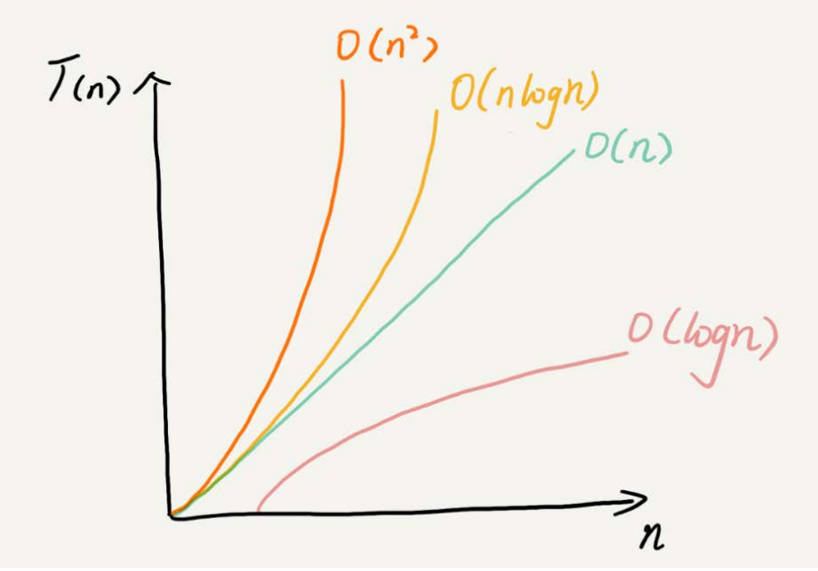

F:\learning\geektime\数据结构\数据结构与算法之美
## 如何分析、统计算法的执行效率和资源消耗
- 事后统计法
    - 依赖测试环境（如不同CPU）
    - 测试结果受数据规模硬性（如排序 受到数据规模和数据初始排序影响）
- 复杂度分析
    - 时间复杂度  渐进时间复杂度（因为是分析随数据规模和算法执行效率的关系）
    - 空间复杂度
## 为什么要分析复杂度
- 分析、统计算法的执行效率和资源消耗
## 什么是复杂度分析
- 时间复杂度和空间复杂度分析
- 描述算法执行时间（或控件）与数据规模增长的关系
- 分析算法的执行效率和资源消耗
- 找到算法的瓶颈 提升性能，解决问题
## 常见时间复杂度

大o表示法

