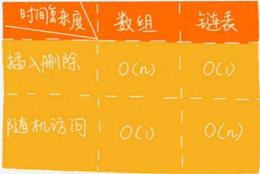

链表通过指针将一组零散的内存块串联在一起。把内存块成为链表的“结点“，每个节点除了存储数据之外，还需记录链表上的下一个节点地址（记录下一个节点的地址的指针叫做后继指针next）
 
第一个结点叫作头结点，用来记录链表基地址；最后一个结点叫作尾结点指向空地址NULL
# 一、各种链表结构
- 单链表
- 双向链表
- 循环链表
- 双向循环链表

## 1.1 单链表
## 1.2 双向链表
删除数据的两种情况
- 删除节点中“值等于某个给定值”的节点
- 删除给定指针指向的节点

第一种情况都需遍历 时间复杂度都是o(n)
第二种情况双向链表查找的时间复杂度为o(1) ，单链表为o(n)
 
双向链表节点多一个pre指针，占用更多的内存，有时更加高效。<b>空间换区时间</b>
 
LinkedHashMap实现用到了双向链表
 

## 1.3 循环链表
## 1.4 双向循环链表

# 二、链表VS数组性能

# 三、内容小结
链表要比数组稍微复杂，从普通的单链表衍生出
来好几种链表结构，比如双向链表、循环链表、双向循环链表。 
和数组相比，链表更适合插入、删除操作频繁的场景，查询的时间复杂度较高。不过，在具体软件开发中，要对数组和链表的各种性能进行对比，综合来选择使
用两者中的哪一个
# 四、课后思考
判断字符串是否是回文字符串
 
如果字符串是通过单链表来存储的，那该如
何来判断是一个回文串呢？你有什么好的解决思路呢？相应的时间空间复杂度又是多少呢？ 
答：
用快慢指针先找到中点，然后把后半段链表reversed，然后一个指针在头部，一个指针再中点，开始逐个比较，时间复杂度是O